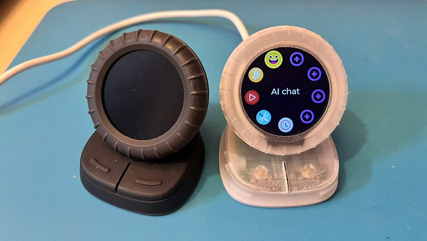

# xDial

the x is pronounced xiao/小



## hardware

https://github.com/hyansuper/xdial_s3_hardware

## dependencies

esp-idf release/v5.5

## build

```sh
git clone https://github.com/hyansuper/xdial_s3.git
cd xdial_s3
git submodule update --init --recursive --recommend-shallow

idf.py set-target esp32s3
idf.py menuconfig 
idf.py build
idf.py flash monitor
```

## create your own app
 
1. create your own app in the the main/apps folder, see main/apps/example_app.c
1. add new files to be compiled in main/CMakeLists.txt
1. add declaration in main/apps/apps.h
1. if you want the app in home screen, add it to app_list in main/apps/home_app.c

## useful tools

### resize png

```sh
python resize_png.py -h
```

### image convert to c code

```sh
python .\components\lvgl\scripts\LVGLImage.py --help

# for example
python .\components\lvgl\scripts\LVGLImage.py .\main\apps\assets\imgs --cf I4 --ofmt C -o .\main\apps\assets\imgs
```

### create resource declare header file

```sh
python .\declare_header.py .\main\apps\assets\imgs\ "*.png" -o .\main\apps\assets\imgs\imgs.h -i "lvgl.h" -d "LV_IMAGE_DECLARE(*);"
```
